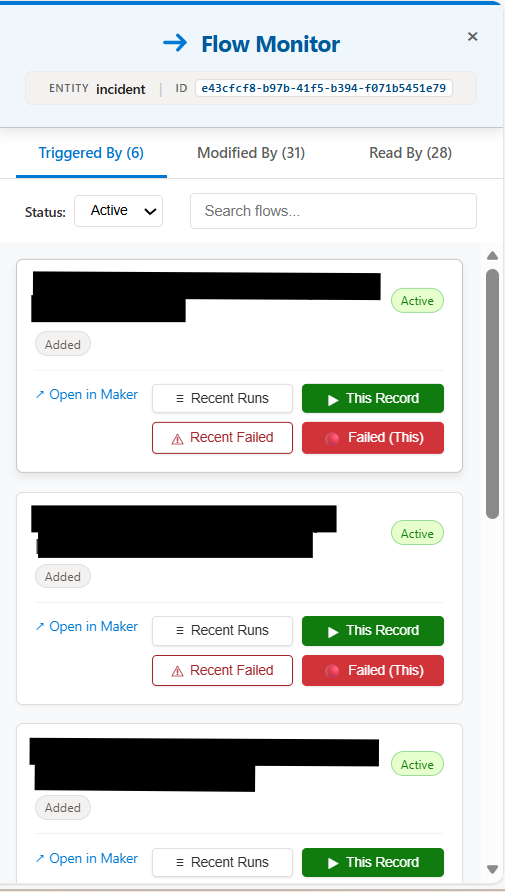
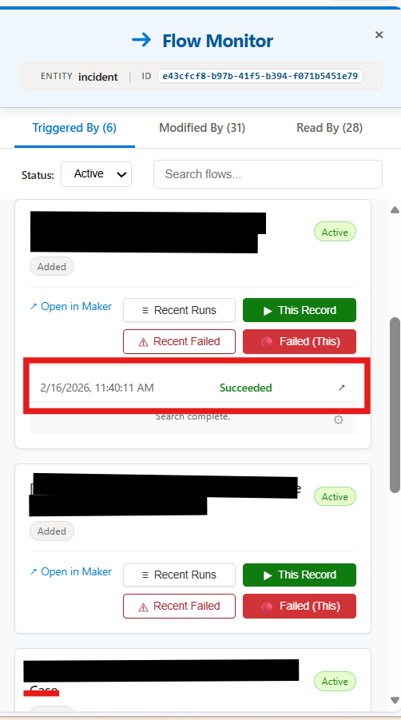
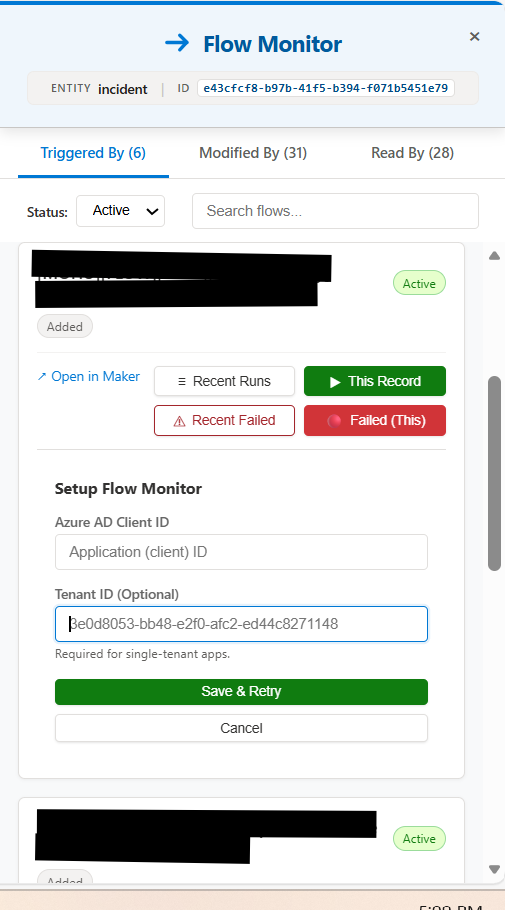
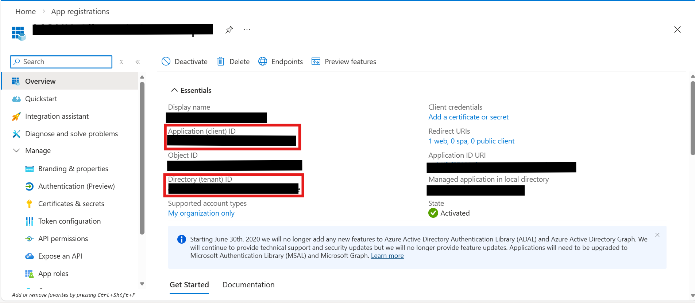
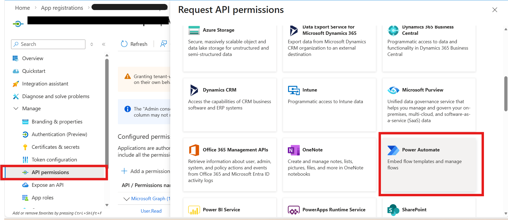
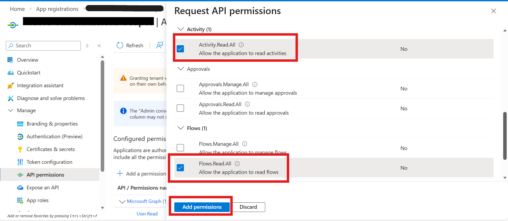
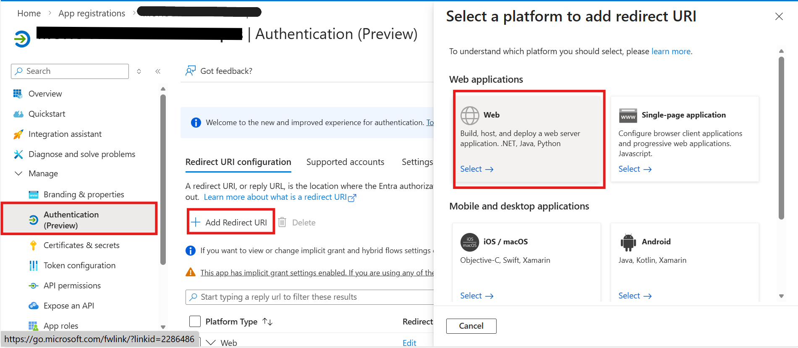
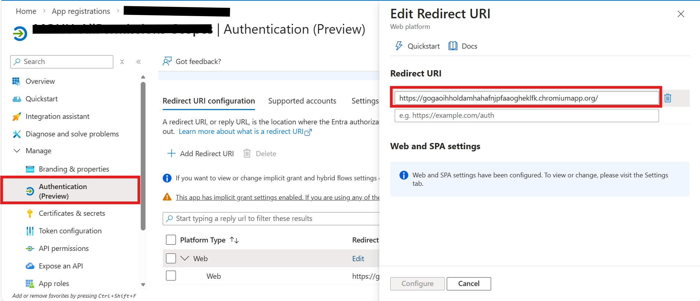

# Dynamics 365 Flow History Extension

[](https://chrome.google.com/webstore)
[](https://opensource.org/licenses/MIT)
[](https://developer.chrome.com/docs/extensions/mv3/)

A browser extension for **Chrome** and **Edge** that allows you to view Power Automate flow run history directly from Dynamics 365 records.

<p align="center">
  
</p>

## :fire: Why This Extension?

**The Problem:** In production environments, when a Power Automate flow fails for a specific Dynamics 365 record, finding that exact run in Power Automate is painful. You have to:
1. Open Power Automate
2. Find the flow
3. Scroll through hundreds/thousands of runs
4. Manually check each run to find the one related to your record

**The Solution:** This extension finds flow runs **for the specific record you're viewing** in seconds, and lets you **open them directly in Power Automate** to debug the issue.

> :stopwatch: **Save hours of troubleshooting time** - No more searching through thousands of flow runs!

---

## :star2: Key Features

### :dart: Record-Specific Run Search
The most powerful feature - find flow runs that are **specifically related to the record you're viewing**:
- **This Record** - Finds all runs triggered by or affecting THIS specific record
- **Failed (This)** - Instantly find failed runs for THIS record only

### :link: One-Click Open in Power Automate
Every flow run can be **opened directly in Power Automate** with a single click. See exactly:
- What triggered the flow
- Which actions succeeded or failed
- Error messages and details
- Input/output data for each step

### :mag: Flow Discovery
Automatically finds all flows related to the current record:
- **Triggered By** - Flows that trigger when this record changes
- **Modified By** - Flows that update this record  
- **Read By** - Flows that retrieve this record

### :zap: Real-time Streaming
Results appear as they're found - no waiting for the entire search to complete.

---

## :camera: Screenshots

<table>
  <tr>
    <td align="center">
      <br>
      <em>Main Panel</em>
    </td>
    <td align="center">
      <br>
      <em>Run History</em>
    </td>
    <td align="center">
      <br>
      <em>Setup Configuration</em>
    </td>
  </tr>
</table>

---

## :rocket: Installation

### From Chrome Web Store (Chrome & Edge)
*Coming Soon*

> :bulb: **Edge Users:** You can install this extension directly from the Chrome Web Store. Go to `edge://extensions/`, enable "Allow extensions from other stores", then install from Chrome Web Store.

### Manual Installation (Developer Mode)

#### Chrome
1. Download or clone this repository
2. Open Chrome and navigate to `chrome://extensions/`
3. Enable **Developer mode** (toggle in top-right)
4. Click **Load unpacked**
5. Select the extension folder

#### Microsoft Edge
1. Download or clone this repository
2. Open Edge and navigate to `edge://extensions/`
3. Enable **Developer mode** (toggle in bottom-left)
4. Click **Load unpacked**
5. Select the extension folder

---

## :gear: Configuration

### Prerequisites
You need an Azure AD App Registration to use the record-specific run search feature.

### Step 1: Create Azure AD App Registration

1. Go to [Azure Portal](https://portal.azure.com)
2. Navigate to **Azure Active Directory** > **App registrations**
3. Click **New registration**
4. Configure:
   - **Name**: `Flow History Extension` (or your choice)
   - **Supported account types**: Choose based on your needs
     - *Single tenant* - Only your organization
     - *Multitenant* - Any Azure AD organization
5. Click **Register**

### Step 2: Copy Client ID and Tenant ID

After creating the app, copy the **Application (client) ID** and **Directory (tenant) ID** from the Overview page:



### Step 3: Configure API Permissions

The extension needs permission to access Power Automate APIs.

1. Go to **API permissions** > Click **Add a permission**



2. Select **Power Automate** (or search for "Flow Service") and add the required permissions:



### Step 4: Configure Authentication (Redirect URI)

1. Go to **Authentication** > Click **Add a platform**



2. Select **Web** and enter your extension's redirect URI:
   ```
   https://<your-extension-id>.chromiumapp.org/
   ```



### Finding Your Extension ID

#### Chrome
1. Go to `chrome://extensions/`
2. Find "Dynamics 365 Flow History"
3. Copy the ID shown below the extension name

#### Microsoft Edge
1. Go to `edge://extensions/`
2. Find "Dynamics 365 Flow History"
3. Copy the ID shown below the extension name

### Step 5: Configure the Extension

1. Click the extension icon on a Dynamics 365 page
2. Click the :gear: gear icon
3. Enter your **Azure AD Client ID**
4. (Optional) Enter your **Tenant ID** or leave blank for "common"
5. Click **Save Settings**

---

## :book: Usage

1. Navigate to any Dynamics 365 record
2. Click the extension icon in Chrome toolbar
3. Click **Open Flow Monitor**
4. Browse flows in the three tabs:
   - **Triggered By** - Flows triggered by changes to this entity
   - **Modified By** - Flows that update this entity
   - **Read By** - Flows that read this entity
5. Click buttons to view run history:

| Button | Description |
|--------|-------------|
| **Recent Runs** | All recent runs (from Dataverse) |
| **This Record** | :star: Runs related to THIS specific record |
| **Recent Failed** | Recent failed runs |
| **Failed (This)** | :star: Failed runs for THIS record only |

6. Click the **↗** link on any run to **open it directly in Power Automate** for detailed debugging

---

## :closed_lock_with_key: Privacy

This extension:
- :white_check_mark: Stores configuration locally only
- :white_check_mark: Does NOT collect personal data
- :white_check_mark: Does NOT track usage analytics
- :white_check_mark: Only communicates with Microsoft services

See [PRIVACY.md](PRIVACY.md) for full details.

---

## :wrench: Development

### Project Structure
```
├── manifest.json          # Extension manifest (V3)
├── background.js          # Service worker (API calls, auth)
├── injector.js            # Content script bridge (ISOLATED world)
├── main_world_script.js   # Main UI & logic (MAIN world)
├── popup.html/js          # Extension popup
├── settings.html/js       # Options page
└── icons/                 # Extension icons
```

### Building
No build step required - this is a vanilla JavaScript extension.

### Testing
1. Load the extension in developer mode
2. Navigate to a Dynamics 365 record
3. Click the extension icon
4. See [TESTING_GUIDE.md](TESTING_GUIDE.md) for detailed testing steps

---

## :memo: Changelog

See [CHANGELOG.md](CHANGELOG.md) for version history.

## :page_facing_up: License

This project is licensed under the MIT License - see [LICENSE](LICENSE) for details.

## :handshake: Contributing

Contributions are welcome! Please feel free to submit a Pull Request.

## :warning: Disclaimer

This extension is not affiliated with, endorsed by, or sponsored by Microsoft Corporation.

---

**Made with :heart: for the Dynamics 365 Community**
